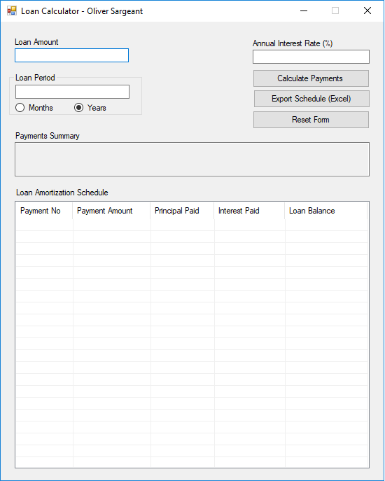

# LoanCalculator
Loan Calculator

C# Windows application which implements and demonstrates loan repayment schedules using the Equal Total Payments method.

Windows Forms technology

Originally written in Visual Studio 2015, converted to Visual Studio 2017

Copyright 2017 - Oliver Sargeant

